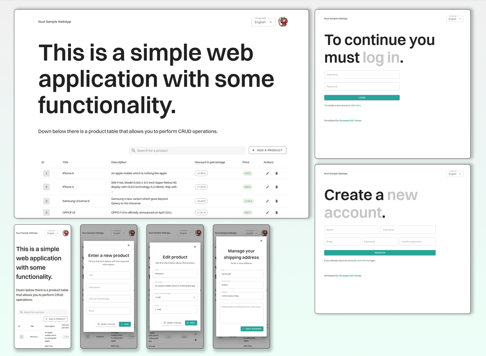

# Nuxtjs Sample Web Application

[](https://lbesson.mit-license.org/) 
[](https://app.netlify.com/sites/nuxt-sample-webapp/deploys)
[](https://github.com/Giuseppetm/nuxt-sample-webapp/issues)



This is a small project I developed for an interview for a front-end developer position that got me through the 2nd technical step.

🎦 [Live Preview](https://nuxt-sample-webapp.netlify.app/)

## Project requirements

### Stack

- Vue + framework of your choice (chosen: NuxtJS);
- Javascript / Typescript (chosen: Typescript);
- UI library of your choice (chosen: Vuetify).

### Description

With the suggested stack make a web app with the following pages:

- Login;
- User registration;
- Shipping address form;
- Table with CRUD operations on elements and server side search.

For Rest API integration/consumption use fake API services at will (chosen: <https://dummyjson.com/>).

As anticipated the goal is the creation of an app that is graphically pleasing and usable from any device focusing on FE aspects.

## Login credentials

| Username | Password |
|----------|----------|
| kminchelle | 0lelplR |

You can find all the mocked APIs here: <https://dummyjson.com/>

## 🕹️ How to run the project locally

1. Install dependencies
   ```sh
   npm install
   ```

2. Run the development server:

   ```sh
   npm run dev
   ```

For deploys I am currently using [Netlify](https://app.netlify.com/).

### Docker

I inserted also a `Dockerfile` and `docker-compose` if you want to use them.
